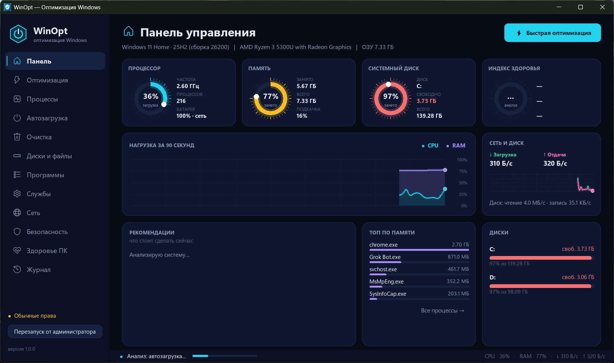
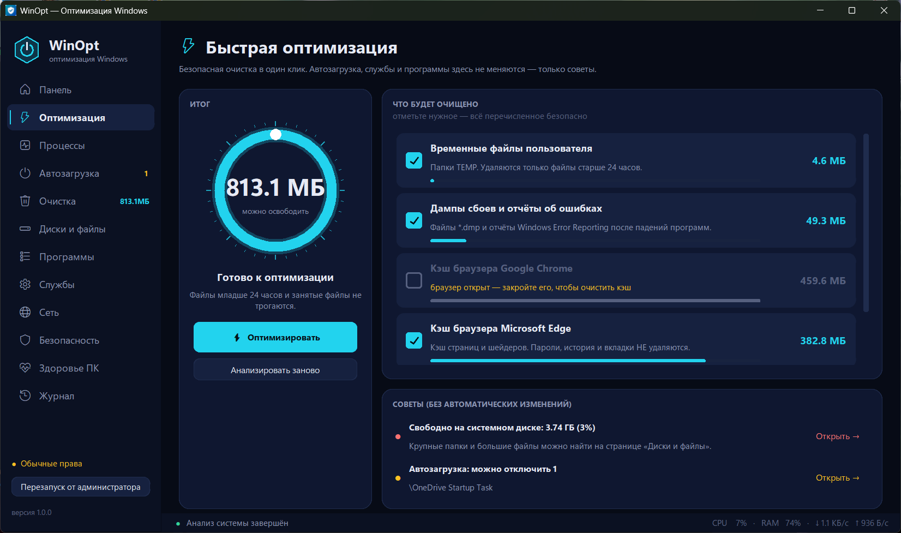
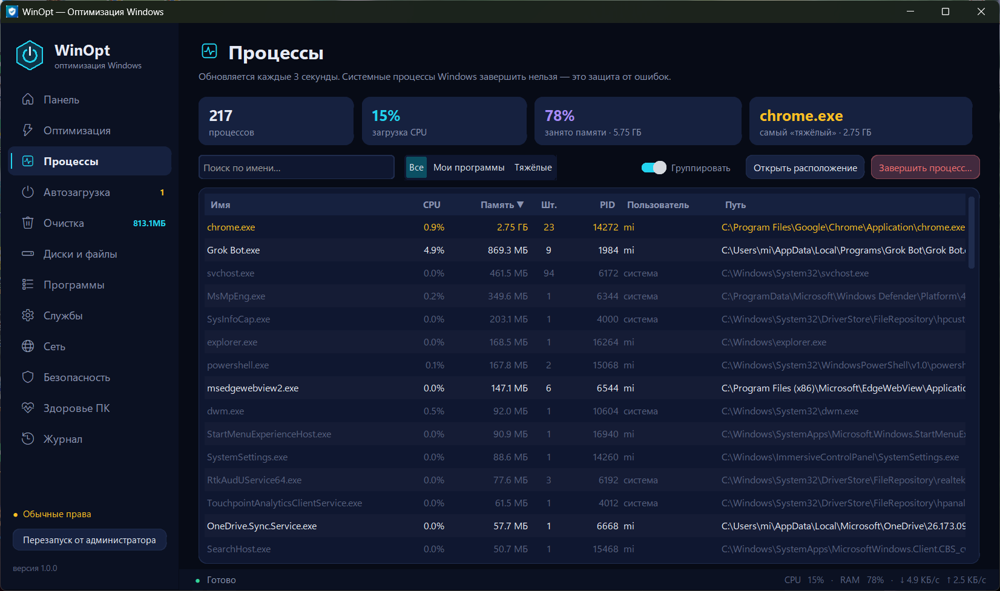
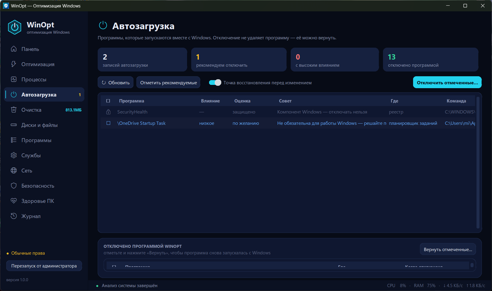
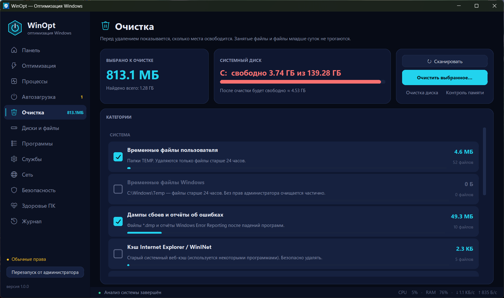
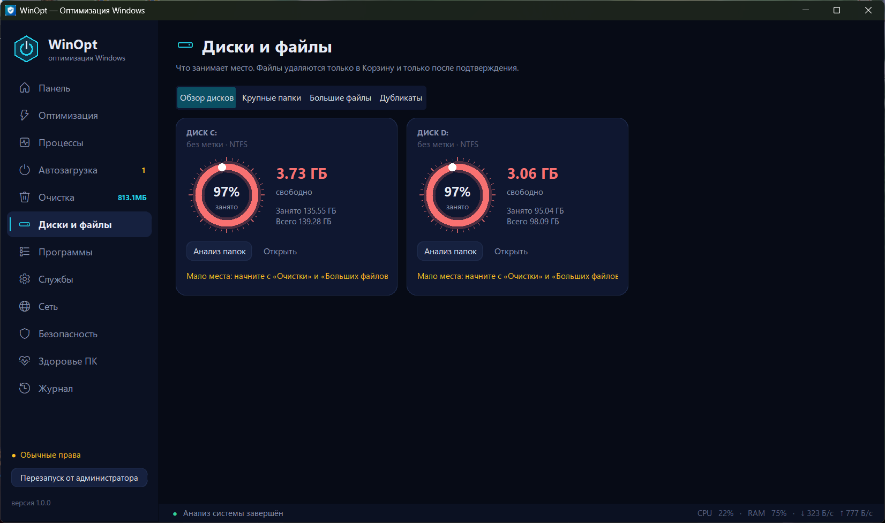
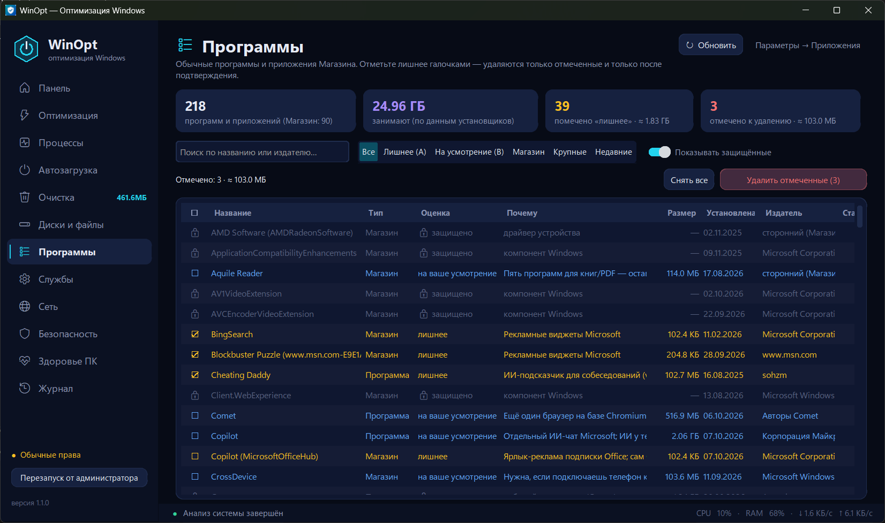
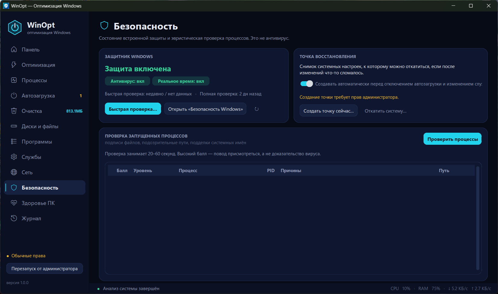
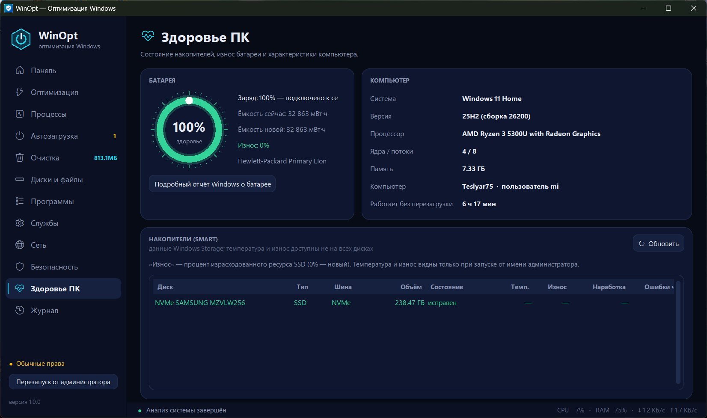
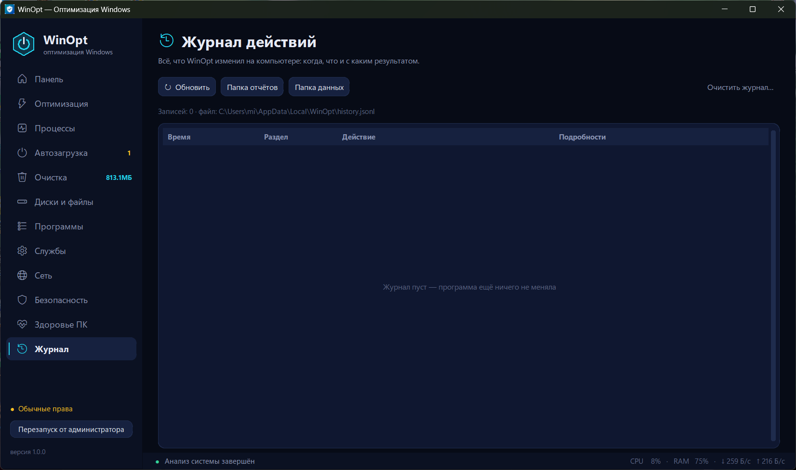

# WinOpt — диагностика и бережная оптимизация Windows

WinOpt — настольная программа для Windows 10/11 на Python: показывает, что происходит с компьютером
в реальном времени, и помогает аккуратно навести порядок — почистить временные файлы, разобраться
с автозагрузкой, найти, что занимает место на диске, и удалить лишние программы.

Главный принцип — **ничего не меняется без вашего подтверждения**: перед каждым действием программа
показывает, что именно будет сделано, файлы удаляются в Корзину, а изменения автозагрузки и служб
можно вернуть одной кнопкой.

> Это не антивирус и не «чистильщик реестра». WinOpt не обещает «ускорить ПК в 10 раз» —
> он показывает реальные данные и делает только безопасные вещи.



## Возможности

| Раздел | Что умеет |
|---|---|
| **Панель** | Живые индикаторы CPU, памяти и системного диска, графики нагрузки за 90 секунд, скорость сети и диска, индекс здоровья ПК (0–100) и рекомендации «что сделать сейчас». |
| **Оптимизация** | Быстрая оптимизация в один клик: показывает, сколько места освободится, и очищает только безопасные категории. Сохраняет текстовый отчёт. |
| **Процессы** | Диспетчер процессов с поиском и группировкой (например, все `chrome.exe`). Завершить можно только свои программы — системные процессы защищены. |
| **Автозагрузка** | Программы и задачи, стартующие с Windows, с оценкой влияния. Отключённое можно вернуть. |
| **Очистка** | Временные файлы (старше 24 часов), дампы сбоев, журналы, кэши браузеров (Chrome, Edge, Яндекс, Brave, Vivaldi, Opera, Firefox — без паролей и истории), Корзина. Размер виден до удаления. |
| **Диски и файлы** | Обзор дисков, крупнейшие папки, большие файлы, дубликаты. Всё удаляется только в Корзину. |
| **Программы** | Обычные программы и приложения Магазина в одном списке с галочками. «Удалить отмеченные (N)» → подтверждение со списком и размером → точка восстановления → удаление по очереди со статусом каждого пункта. Драйверы, Visual C++, .NET, Docker/WSL, антивирусы и компоненты Windows защищены от удаления. |
| **Службы** | Сторонние службы с автозапуском; обновляторы можно перевести в «Вручную» и вернуть обратно. Службы драйверов и антивирусов заблокированы. |
| **Сеть** | График трафика и подключения программ к интернету. |
| **Безопасность** | Состояние Защитника Windows и быстрая проверка, точка восстановления, эвристическая проверка запущенных процессов. |
| **Здоровье ПК** | Износ батареи, состояние SSD/HDD (SMART), сведения о системе. |
| **Журнал** | Всё, что программа изменила: когда, что и с каким результатом. |

## Скриншоты

| | |
|---|---|
|  **Быстрая оптимизация** |  **Процессы** |
|  **Автозагрузка** |  **Очистка** |
|  **Диски и файлы** |  **Программы** |
|  **Безопасность** |  **Здоровье ПК** |
|  **Журнал** | |

## Принципы безопасности

- Любое удаление или изменение — только после диалога подтверждения со списком того, что будет сделано.
- Перед изменением автозагрузки, служб и удалением программ предлагается создать точку восстановления.
- Файлы пользователя (дубликаты, большие файлы) удаляются **в Корзину**; удалить все копии файла программа не даст.
- Временные файлы младше 24 часов и занятые файлы не трогаются; кэш открытого браузера пропускается.
- Системные процессы, службы драйверов и антивирусов, ключевые компоненты Windows защищены.
- Всё, что сделано, записывается в журнал; отключённую автозагрузку и изменённые службы можно вернуть.
- Программа ничего не отправляет в интернет.

## Требования

- Windows 10 или 11
- Python 3.10 или новее (проверено на Python 3.14)
- Библиотеки: [`psutil`](https://pypi.org/project/psutil/) и [`customtkinter`](https://pypi.org/project/customtkinter/)

## Установка и запуск

```bat
git clone https://github.com/Teslyar75/WinOpt.git
cd WinOpt
python -m pip install -r requirements.txt
python -m winopt
```

При первом запуске на рабочем столе создаётся ярлык «Оптимизация Windows» (запуск без консольного окна).
Создать его вручную: `python -m winopt shortcut`.

Часть функций (службы, точка восстановления, журналы Windows, SMART) требует прав администратора —
в программе есть кнопка «Перезапуск от администратора».

## Команды CLI

```text
python -m winopt                         открыть окно
python -m winopt gui --page programs     открыть сразу нужный раздел
python -m winopt scan                    проверка процессов
python -m winopt resources               нагрузка CPU/RAM
python -m winopt startup                 список автозагрузки
python -m winopt cleanup --scan          сколько можно очистить
python -m winopt cleanup --all --yes     очистка безопасных категорий
python -m winopt duplicates              поиск повторяющихся файлов
python -m winopt disk [--drive D:]       крупные папки на диске
python -m winopt large-files [--min-mb 500]
python -m winopt health                  SSD/HDD и батарея
python -m winopt history                 журнал действий
python -m winopt network [--external]    сетевые подключения
python -m winopt programs --filter all|large|recent|no_publisher|A|B|store|removable
python -m winopt services                службы, которые можно перевести в «Вручную»
python -m winopt restore-point --yes     точка восстановления (нужен администратор)
python -m winopt report                  полный отчёт в JSON
python -m winopt --version
```

Разделы для `--page`: `dashboard`, `optimize`, `processes`, `startup`, `cleanup`, `disk`, `programs`,
`services`, `network`, `security`, `health`, `journal`.

## Структура проекта

```text
WinOpt/
├── winopt/                 исходный код
│   ├── __main__.py         точка входа (python -m winopt)
│   ├── cli.py              консольные команды
│   ├── winutil.py          PowerShell без окон, права администратора, форматирование
│   ├── cleanup.py          очистка временных файлов и кэшей
│   ├── programs.py         программы и приложения Магазина, защита, удаление
│   ├── startup.py, actions.py, advice.py   автозагрузка
│   ├── services.py, processes.py, network.py, disk.py, duplicates.py, health.py ...
│   └── ui/                 интерфейс (CustomTkinter)
│       ├── app.py, theme.py, widgets.py
│       └── pages/          разделы окна
├── assets/                 иконка
├── docs/                   подробная документация (README.txt, описание файлов)
├── screenshots/            скриншоты для этого README
└── requirements.txt
```

Данные программы хранятся в `%LOCALAPPDATA%\WinOpt\`: журнал действий, отключённая автозагрузка,
изменённые службы, отчёты.

Необязательный файл `data\programs-review.csv` (или `%LOCALAPPDATA%\WinOpt\programs-review.csv`) —
обзор установленных программ с категориями A («лишнее») и B («на ваше усмотрение»); если он есть,
на странице «Программы» появляются оценки и фильтры по ним. В репозиторий он не входит, так как
описывает конкретный компьютер.

Подробная документация на русском — в [`docs/README.txt`](docs/README.txt) и
[`docs/opisanie-fajlov.txt`](docs/opisanie-fajlov.txt).

## Лицензия

Лицензия пока не выбрана — по умолчанию все права принадлежат автору.
